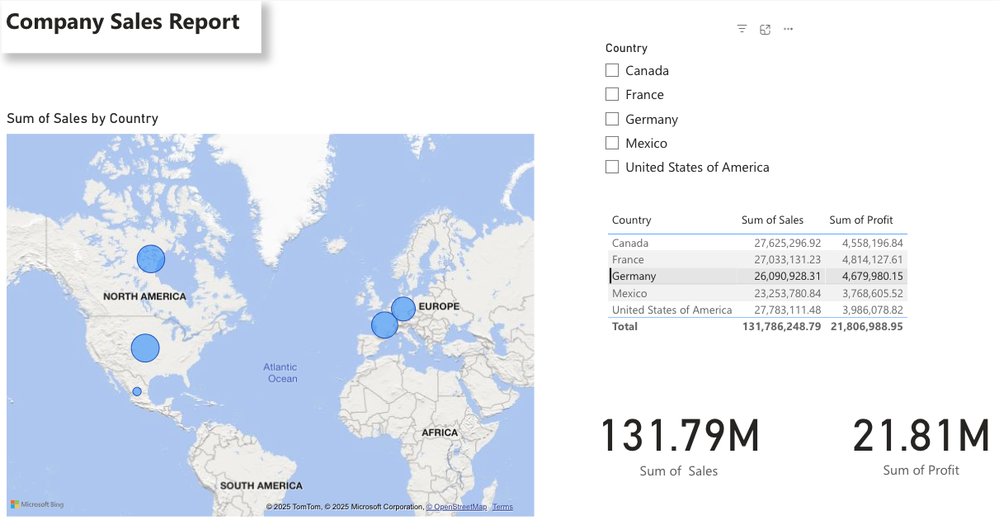

## global-company-sales-powerbi-dashboard
In this project, I created a sales report dashboard for a global company sales dataset with 700 entries using the data visualization tool PowerBI, hoping to organize and visualize sales, revenue, and profit information with an interactive map.
# 📊 Global Sales Insights – Power BI Dashboard
 You can view the PowerBI dashboard by opening the pbix file below in PowerBI desktop.
 
 

## 📌 Overview

- **Tool:** Power BI (web version)
- **Data Source:** Global Company Sales Mock Data
- **Techniques:** Data cleaning, visualization, DAX measures, dashboard design

## 📊 Dashboard Preview

## 🧠 Key Insights

- 📈 Though the company received the highest amount of sales in the United States, they actually profited the most in France.
- 💬 In total, the company accomplished 131.79 million dollars in sales across the 5 different countries.
- 🧵 The company actually only profited 21.81 million dollars from their sales, indicating a profit margin of 16.55%, which is solid and sustainable for most technology businesses.

## 🗂 Files

| File | Description |
|------|-------------|
| `GlobalCompanySalesReport.pbix` | Power BI file |
| `PowerBIDashboard.png` | Screenshot of the dashboard and visuals |
| GlobalCompanySalesMockData.xlsx | Global Company Sales Mock Dataset |

## 🚀 How to Use

If you'd like to explore the visuals:
1. Open the `.pbix` file in Power BI Desktop.
2. OR view screenshots attached.
